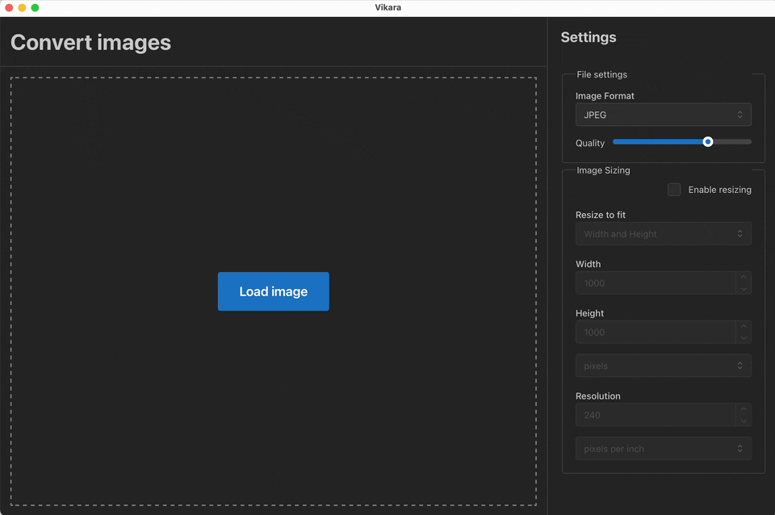

# Vikara - Desktop app to convert images

A simple desktop application to convert images. You can change the quality and dimensions of the converted images.

## Supported image file formats
  - JPEG
  - PNG
  - TIFF
  - WEBP
  - BMP
  - ICO
  - GIF
  - AVIF
  - HEIC/HEIF

## Supported RAW file format
  - raf
  - cr2
  - mrw
  - arw
  - srf
  - sr2
  - mef
  - orf
  - srw
  - erf
  - kdc
  - dcs
  - rw2
  - dcr
  - pef
  - crw
  - raw
  - iiq
  - 3rf
  - nrw
  - nef
  - mos
  - ari

TODO:

- [ ] Remember the conversion settings last used by the user. Use tauri store.
